

    <a href="http://www.52im.net/thread-52-1-1.html">
    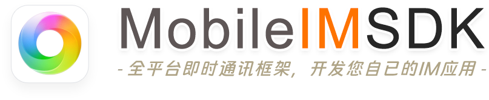
    </a>

[文档手册](http://www.52im.net/forum.php?mod=collection&action=view&ctid=1&fromop=all)・[技术社区](http://www.52im.net/forum-89-1.html)・[更新日志](http://www.52im.net/thread-1270-1-1.html)・[产品案例❶](http://www.52im.net/thread-20-1-1.html)・[产品案例❷](http://www.52im.net/thread-4824-1-1.html)・[产品案例❸](http://www.52im.net/thread-2470-1-1.html)

:heart: <b>最新动态：</b> [RainbowChat iOS v10.2](https://gitee.com/jackjiang/MobileIMSDK/issues/ID1OJ6)已发布（全面适配iOS26）。[鸿蒙Next端](https://gitee.com/jackjiang/MobileIMSDK/issues/IBCI00)IM产品[RainbowTalk](http://www.52im.net/thread-4822-1-1.html)已发布。:heart:

# 一、快捷目录

* <b>❶ 📗 理论资料：</b>[网络编程理论经典《TCP/IP详解》（在线阅读版）](http://www.52im.net/topic-tcpipvol1.html) :triangular_flag_on_post:
* <b>❷ 📗 相关资料：</b>[版本更新日志](http://www.52im.net/thread-1270-1-1.html)、[常见问题解答](http://www.52im.net/thread-60-1-1.html) 、[性能测试报告](http://www.52im.net/thread-57-1-1.html) :triangular_flag_on_post:
* <b>❸ 📗 开发指南：</b> [Android](http://www.52im.net/thread-61-1-1.html)、[iOS](http://www.52im.net/thread-62-1-1.html)、[Java](http://www.52im.net/thread-59-1-1.html)、[H5](http://www.52im.net/thread-4239-1-1.html)、[微信小程序](http://www.52im.net/thread-4168-1-1.html)、[Uniapp](http://www.52im.net/thread-4226-1-1.html)、[鸿蒙Next](http://www.52im.net/thread-4767-1-1.html)、[服务端](http://www.52im.net/thread-63-1-1.html)。
* <b>❹ 📗 API文档：</b> [Android](http://docs.52im.net/extend/docs/api/mobileimsdk/android_tcp/)、[iOS](http://docs.52im.net/extend/docs/api/mobileimsdk/ios_tcp/)、[Java](http://docs.52im.net/extend/docs/api/mobileimsdk/java_tcp/)、[H5](http://www.52im.net/thread-4239-1-1.html)、[微信小程序](http://www.52im.net/thread-4168-1-1.html)、[Uniapp](http://www.52im.net/thread-4226-1-1.html)、鸿蒙Next（[完整手册](http://www.52im.net/thread-4767-1-1.html)、[API文档](http://docs.52im.net/extend/docs/api/mobileimsdk/harmony/)）、[服务端](http://docs.52im.net/extend/docs/api/mobileimsdk/server/)。
* <b>❺ 📦 Demo安装和帮助：</b>  [Android](http://www.52im.net/thread-55-1-1.html)、[iOS](http://www.52im.net/thread-54-1-1.html)、[Java](http://www.52im.net/thread-56-1-1.html)、[H5](http://www.52im.net/thread-3682-1-1.html)、[微信小程序](http://www.52im.net/thread-4169-1-1.html)、[Uniapp](http://www.52im.net/thread-4225-1-1.html)、[鸿蒙Next](http://www.52im.net/thread-4766-1-1.html) :new:、[服务端](http://www.52im.net/thread-1272-1-1.html)。
* <b>❻ 🍀 产品案例1：</b> RainbowChat产品（[详细介绍](http://www.52im.net/thread-19-1-1.html)、[安装体验](http://www.52im.net/thread-4739-1-1.html)、[Android运行截图](http://www.52im.net/thread-20-1-1.html) 、[iOS运行截图](http://www.52im.net/thread-2730-1-1.html) ） :point_left:
* <b>❼ 🍀 产品案例2：</b> RainbowTalk产品（[详细介绍](http://www.52im.net/thread-4822-1-1.html)、[安装体验](http://www.52im.net/thread-4825-1-1.html)、[运行截图](http://www.52im.net/thread-4824-1-1.html) ） :point_left:
* <b>❽ 🍀 产品案例3：</b>RainbowChat_Web产品（[详细介绍](http://www.52im.net/thread-2483-1-1.html)、[运行截图](http://www.52im.net/thread-2470-1-1.html) ） :point_left:

# 二、项目简介

<b>MobileIMSDK是一套全平台IM通信层框架：</b> 
* 历经10年、久经考验；
* 超轻量级、高度提炼，lib包50KB以内；
* 精心封装，一套API优雅支持<b>UDP</b> 、<b>TCP</b> 、<b>WebSocket</b>  三种协议（可能是全网唯一开源的）；
* 客户端支持iOS、Android、标准Java、H5([精编注释版](http://www.52im.net/thread-3682-1-1.html))、小程序([精编注释版](http://www.52im.net/thread-4169-1-1.html))、Uniapp([精编注释版](http://www.52im.net/thread-4225-1-1.html))、鸿蒙Next([SDK精编注释版](http://www.52im.net/thread-4766-1-1.html)、[Demo完整源码](https://gitee.com/jackjiang/MobileIMSDK/tree/master/demo_src/WebSocket/MobileIMSDK4HarmonyDemo))；
* 服务端基于Netty，性能卓越、易于扩展； :point_left:
* 可与姊妹工程 [MobileIMSDK-Web](http://www.52im.net/thread-959-1-1.html) 无缝互通实现网页端聊天或推送等； :point_left:
* 可应用于跨设备、跨网络的聊天APP、企业OA、消息推送等各种场景。

:bulb: <b>特别说明：</b>目前H5、小程序、Uniapp、鸿蒙暂无免费的开源版，只有[精编注释版](http://www.52im.net/thread-411-1-1.html)（相当于少量的知识付费价），原因是有一点点私心，希望从开源中获得一点点收益。感恩你的谅解 🤝。

# 三、源码仓库同步更新

<b>当前源码仓库：</b> 

* ❶ <b>GitHub：</b> [https://github.com/JackJiang2011/MobileIMSDK](https://github.com/JackJiang2011/MobileIMSDK)；
* ❷ <b>码云gitee：</b> [http://git.oschina.net/jackjiang/MobileIMSDK](http://git.oschina.net/jackjiang/MobileIMSDK)；
* ❸ <b>Gitcode：</b> [https://gitcode.com/hellojackjiang2011/MobileIMSDK](https://gitcode.com/hellojackjiang2011/MobileIMSDK)。

<b>仓库文件目录：</b> 
|   | 目录名          | 目录用途说明  |
|---|--------------|----------------------------------------------------------------------|
| 1 | 💎 [/demo_binary](https://gitee.com/jackjiang/MobileIMSDK/tree/master/demo_binary)  | 🌟 内含编译好的Demo程序（含移动端和服务端），可直接安装到手机或电脑运行。|
| 2 | 💎 [/demo_src](https://gitee.com/jackjiang/MobileIMSDK/tree/master/demo_src)    | 🌟 内含MobileIMSDK的所有Demo源码。                                      |
| 3 | 💎 [/sdk_binary](https://gitee.com/jackjiang/MobileIMSDK/tree/master/sdk_binary)  | 🌟 内含编译好的MobileIMSDK核心库lib，可直接引用到自已的工程中。 |
| 4 | 💎 [/sdk_src](https://gitee.com/jackjiang/MobileIMSDK/tree/master/sdk_src)     | 🌟 内含MobileIMSDK核心库源码。                                         |
| 5 | 💎 [/docs](https://gitee.com/jackjiang/MobileIMSDK/tree/master/docs)        | 🌟 内含API文档。                                                             | 
| 6 | 💎 [/preview](https://gitee.com/jackjiang/MobileIMSDK/tree/master/preview)     | 🌟 内含Demo和产品案例的运行截图，供参考。 |
| 7 | 💎 [/release_notes](https://gitee.com/jackjiang/MobileIMSDK/tree/master/release_notes) | 🌟 内含历次版本更新日志（[也可从网页查看](http://www.52im.net/thread-1270-1-1.html)）。 |

# 四、设计目标
让开发者专注于应用逻辑的开发，底层<code>复杂的即时通讯算法交由SDK开发人员</code>，从而<code>解偶即时通讯应用开发的复杂性</code>。

# 五、框架组成

<b>整套MobileIMSDK框架由以下部分组成：</b>

|   | 平台 | 完成度  | Demo演示      | 开发指南 | 源码位置 | 参考应用案例 |
|---|----|------|--------|------    |------|--------|
| 1  |  **Android**   |   ✅   | [安装和使用](http://www.52im.net/thread-55-1-1.html) | [查看](http://www.52im.net/thread-61-1-1.html) | [源码目录](https://gitee.com/jackjiang/MobileIMSDK/tree/master/sdk_src/TCP_Client/MobileIMSDK4a_tcp_Open/) | [查看](http://www.52im.net/thread-20-1-1.html) 🔥 |
| 2  |   **iOS**      |   ✅   | [安装和使用](http://www.52im.net/thread-54-1-1.html) | [查看](http://www.52im.net/thread-62-1-1.html) | [源码目录](https://gitee.com/jackjiang/MobileIMSDK/tree/master/sdk_src/TCP_Client/MobileIMSDK4i_tcp_Open/) | [查看](http://www.52im.net/thread-2730-1-1.html) 🔥 |
| 3  |    **Java**    |   ✅   | [安装和使用](http://www.52im.net/thread-56-1-1.html) | [查看](http://www.52im.net/thread-59-1-1.html) | [源码目录](https://gitee.com/jackjiang/MobileIMSDK/tree/master/sdk_src/TCP_Client/MobileIMSDK4j_tcp_Open/) |        |
| 4  |   **HTML5**    |   ✅   | [运行演示](http://www.52im.net/thread-3682-1-1.html#11)   | [查看 ](http://www.52im.net/thread-4239-1-1.html)| [精编注释版](http://www.52im.net/thread-3682-1-1.html) | [查看](http://www.52im.net/thread-2470-1-1.html) 🔥 |
| 5  | **微信小程序** |   ✅   | [运行演示](http://www.52im.net/thread-4169-1-1.html#10)   | [查看](http://www.52im.net/thread-4168-1-1.html) | [精编注释版](http://www.52im.net/thread-4169-1-1.html) |        |
| 6  |   **Uniapp**   |   ✅   | [运行演示](http://www.52im.net/thread-4225-1-1.html#10)   | [查看](http://www.52im.net/thread-4226-1-1.html) | [精编注释版](http://www.52im.net/thread-4225-1-1.html)|        |
| 7  | **鸿蒙Next**  ⭐️|   ✅   | [HarmonyChat](https://gitee.com/jackjiang/harmonychat) 🔥   | [查看](http://www.52im.net/thread-4767-1-1.html) | [精编注释版](http://www.52im.net/thread-4766-1-1.html) | [查看](http://www.52im.net/thread-4824-1-1.html) 🔥 |
| 8  |  **Flutter**   |   ☑️   |           |      | [社区版本](https://github.com/Wongxd/MobileIMSDK/tree/master/sdk_src/TCP_Client/MobileIMSDK4f_tcp_Open) |        |
| 9  |  **Server**  ⭐️⭐️|   ✅   | [安装和使用](http://www.52im.net/thread-1272-1-1.html)  | [查看](http://www.52im.net/thread-63-1-1.html) | [源码目录](https://gitee.com/jackjiang/MobileIMSDK/tree/master/sdk_src/Server/MobileIMSDKServer_Open) |  |

<b>整套MobileIMSDK框架的架构原理图：</b>

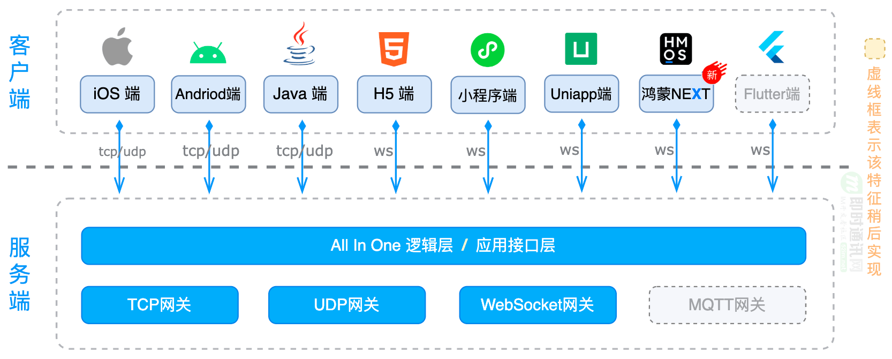

:bulb: <b>补充说明：</b>MobileIMSDK一直在持续开发和升级中，[鸿蒙Next客户端](http://www.52im.net/thread-4766-1-1.html) 是MobileIMSDK工程的最新成果。<b>另外：</b>MobileIMSDK可与姊妹工程 [MobileIMSDK-Web](http://www.52im.net/thread-959-1-1.html) 无缝互通，从而实现Web网页端聊天或推送等。

# 六、技术特征
* <b>久经考验：</b>历经10年，从Andriod 2.3、iOS 5.0 时代持续升级至今（绝不烂尾）；
* <b>超轻量级：</b>高度提炼，lib包50KB以内；
* <b>多种协议：</b>可能是全网唯一开源可一套API同时支持UDP、TCP、WebSocket三种协议的同类框架  :new:；
* <b>多种网络：</b>精心优化的TCP、UDP、WebSocket协议实现，可应用于卫星网、移动网、嵌入式物联网等场景；
* <b>多端覆盖：</b>客户端支持iOS、Android、标准Java、[H5](http://www.52im.net/thread-3682-1-1.html)、[微信小程序](http://www.52im.net/thread-4169-1-1.html)、[Uniap](http://www.52im.net/thread-4225-1-1.html)、[鸿蒙Next](http://www.52im.net/thread-4766-1-1.html)；
* <b>高效费比：</b>独有的UDP协议实现，无连接特性，同等条件下可实现更高的网络负载和吞吐能力；
* <b>消息走向：</b>支持即时通讯技术中消息的所有可能走向，共3种（即C2C、C2S、S2C）；
* <b>粘包半包：</b>优雅解决各端的TCP经典粘包和半包问题，底层封装，应用层完全无感知；
* <b>QoS机制：</b>完善的消息送达保证机制（自动重传、消息去重、状态反馈等），不漏过每一条消息；
* <b>健壮可靠：</b>实践表明，非常适于在高延迟、跨洲际、不同网络制式环境中稳定、可靠地运行；
* <b>断网恢复：</b>拥有网络状况自动检测、断网自动治愈的能力；
* <b>原创算法：</b>核心算法和实现均为原创，保证了持续改进和提升的空间；
* <b>多种模式：</b>预设多种实时灵敏度模式，可根据不同场景控制即时性、流量和客户端电量消耗；
* <b>数据压缩：</b>自有协议实现，未来可自主定制数据压缩，灵活控制客户端的流量、服务端网络吞吐；
* <b>高度封装：</b>高度封装的API接口，保证了调用的简易性，也使得可应用于更多的应用场景；
* <b>Web支持：</b>可与姊妹工程 [MobileIMSDK-Web](http://www.52im.net/thread-959-1-1.html) 无缝互通实现网页端聊天或推送等；:point_left:
* <b>扩展性好：</b>服务端基于Netty，继承了Netty的优秀高可扩展性；
* <b>性能优异：</b>服务端继承了Netty高性能、高吞吐特性，适用于高性能服务端场景。

> <b>MobileIMSDK 所支持的全部3种即时通讯消息走向分别是：</b> 
  (1) Client to Client (C2C)：即由某客户端主动发起，接收者是另一客户端； 
  (2) Client to Server (C2S)：即由某客户端主动发起，接收者是服务端； 
  (3) Server to Client (S2C)：即由服务端主动发起，接收者是某客户端。
  
:point_right: 您可能需要：[查看更多关于MobileIMSDK的疑问及解答](http://www.52im.net/thread-60-1-1.html)。

# 七、性能测试
压力测试表明，MobileIMSDK用于推送场景时，理论单机负载可接近千万级。用于聊天应用时，单机负载也可达数十万（ :point_right: 性能测试报告：[点此查看](http://www.52im.net/thread-57-1-1.html)）。

> 当然，每款应用都有各自的特点和差异，请视具体场景具体评估之，测试数据仅供参考。

# 八、典型应用场景
### :triangular_flag_on_post: 场景1：聊天APP
* <b>应用说明：</b>可用于开发类似于微信、QQ等聊天工具。 
* <b>消息走向：</b>需使用C2C、C2S、S2C全部类型。 
* <b>特别说明：</b>MobileIMSDK并未定义聊天应用的应用层逻辑和协议，开发者可自行定义并实现之。

### :triangular_flag_on_post: 场景2：消息推送
* <b>应用说明：</b>可用于需要向客户端实时推送信息的各种类型APP。 
* <b>消息走向：</b>仅需使用S2C 1种消息走向，属MobileIMSDK的最简单应用场景。

### :triangular_flag_on_post: 场景3：企业OA
* <b>应用说明：</b>可用于实现企业OA的指令、公文、申请等各种消息实时推送，极大提升用户体验，并可延伸至移动设备。 
* <b>消息走向：</b>仅需使用S2C 1种消息走向，属MobileIMSDK的最简单应用场景。

### :triangular_flag_on_post: 场景4：企业OA的增强型
* <b>应用说明：</b>可用于实现企业OA中各种系统级、用户级消息的实时互动，充分利用即时通讯技术提升传统OA的价值。 
* <b>消息走向：</b>可使用C2C、C2S、S2C全部类型，这与聊天APP在很多方面已无差别，但企业OA有自已的用户关系管理模型和逻辑，较之全功能聊天APP要简单的多。

# 九、应用案例

|   | 案例名             | 用途说明 | 详细介绍 | 安装体验 | 运行演示 |
|---|-----------------|----|----|----|----|
| 1 |  **RainbowChat**    | 产品级Android和iOS聊天APP| [点击查看](http://www.52im.net/thread-19-1-1.html) |[下载安装](http://www.52im.net/thread-4739-1-1.html) 🔥|[Android截图](http://www.52im.net/thread-20-1-1.html) 、[iOS截图](http://www.52im.net/thread-2730-1-1.html)|
| 2 |  **RainbowChat-Web**| Web网页端产品级聊天系统| [点击查看](http://www.52im.net/thread-2483-1-1.html) |[运行视频](http://www.52im.net/thread-2491-1-1.html)|[全功能截图](http://www.52im.net/thread-2470-1-1.html)|
| 3 |  **RainbowTalk** ⭐️ | 纯血鸿蒙NEXT产品级聊天APP| [点击查看](http://www.52im.net/thread-4822-1-1.html) |[下载安装](http://www.52im.net/thread-4825-1-1.html) 🔥|[全功能截图](http://www.52im.net/thread-4824-1-1.html)|

# 十、授权方式
你可永久免费且自由地使用MobileIMSDK，如：用于研究、借鉴、甚至商业用途，但禁止在超越License约束内容的情况下用于商业用途等，请尊重知识产权。更详细的授权说明，请见[MobileIMSDK社区介绍贴](http://www.52im.net/thread-52-1-1.html)中的“十二、授权方式”一节。<b>如您还需获得更多技术支持或技术合作请联系作者。</b>

# 十一、捐助作者
优秀的开源需要您的支持才能走的更远，衷心感谢您的支持与理解，也希望您能从开源中收益。❤️ <b>捐助链接</b>： [点此进入](http://www.52im.net/thread-411-1-1.html) 。

💚 <b>如您恰好需要，也可以支持作者的其它工程 </b>：[RainbowChat](http://www.52im.net/thread-19-1-1.html)、[RainbowChat-Web](http://www.52im.net/thread-2483-1-1.html)、[RainbowTalk](http://www.52im.net/thread-4822-1-1.html) 。

# 十二、联系方式
🔥 [技术和资料专区](http://www.52im.net/forum-89-1.html) ・ 
[技术交流群](http://www.52im.net/portal.php?mod=topic&topicid=2) ・ [个人博客](http://www.52im.net/space-uid-1.html) ・ [Github主页](https://github.com/JackJiang2011) ・ [联系作者](http://www.52im.net/thread-2792-1-1.html) 🔥

# 十三、Demo运行截图
### 1、MobileIMSDK Demo在鸿蒙Next端运行效果：
> <code>编译和运行：</code>[查看鸿蒙Next端Demo完整源码](https://gitee.com/jackjiang/MobileIMSDK/tree/master/demo_src/WebSocket/MobileIMSDK4HarmonyDemo)。

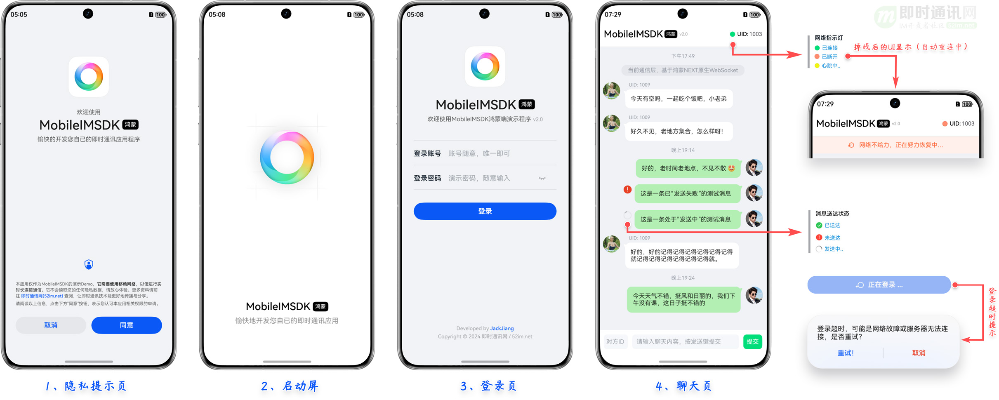

### 2、MobileIMSDK Demo在Android端、iOS端运行效果：
> <code>安装和使用：</code>[进入Android版Demo帮助页](http://www.52im.net/thread-55-1-1.html)、[进入iOS版Demo帮助页](http://www.52im.net/thread-54-1-1.html)。

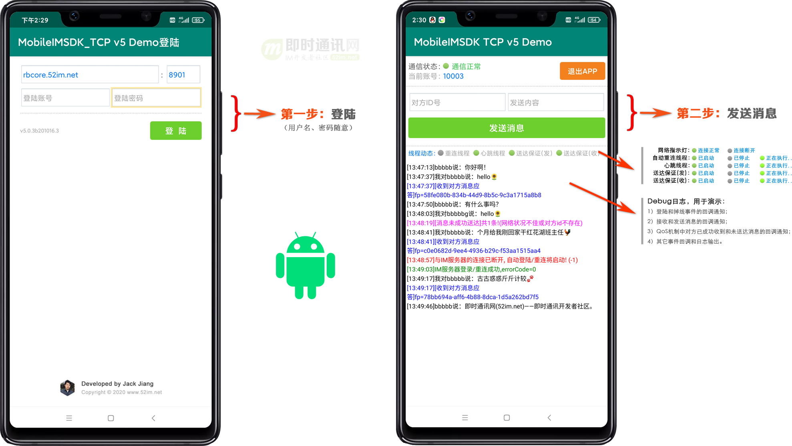

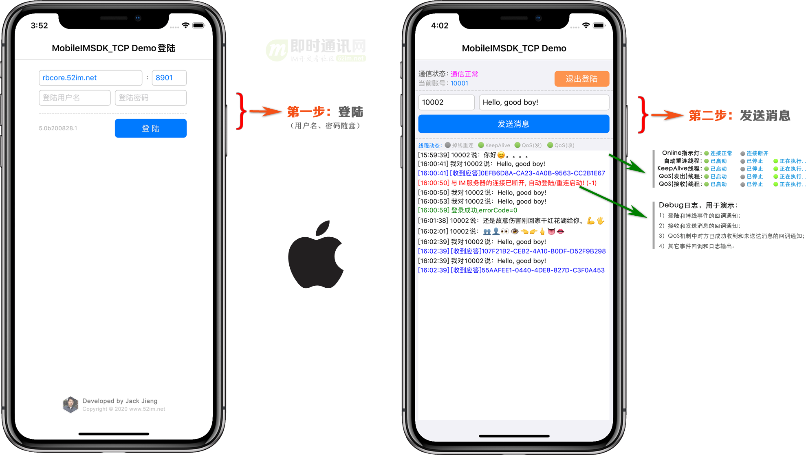

### 3、MobileIMSDK Demo在H5端运行效果：

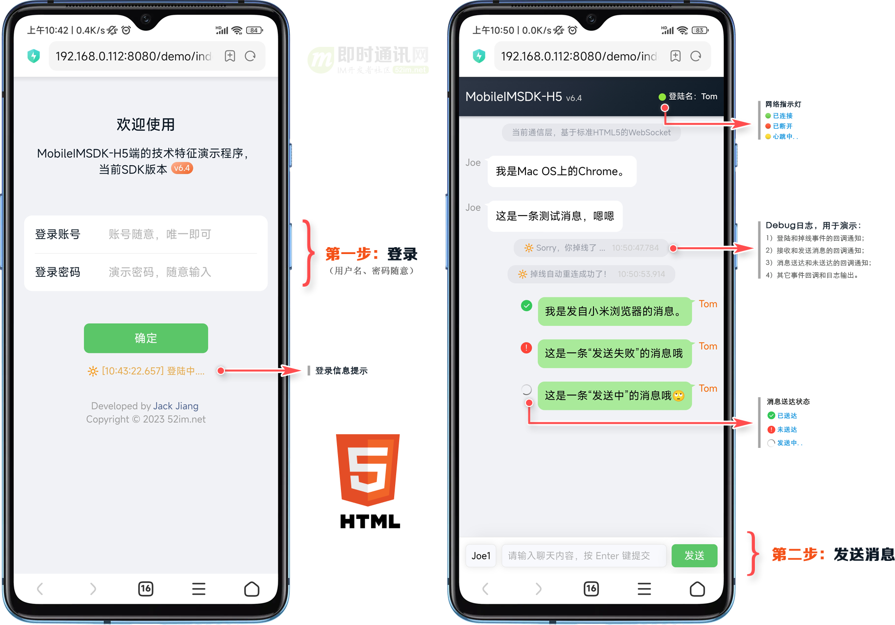

### 4、MobileIMSDK Demo在微信小程序端运行效果：

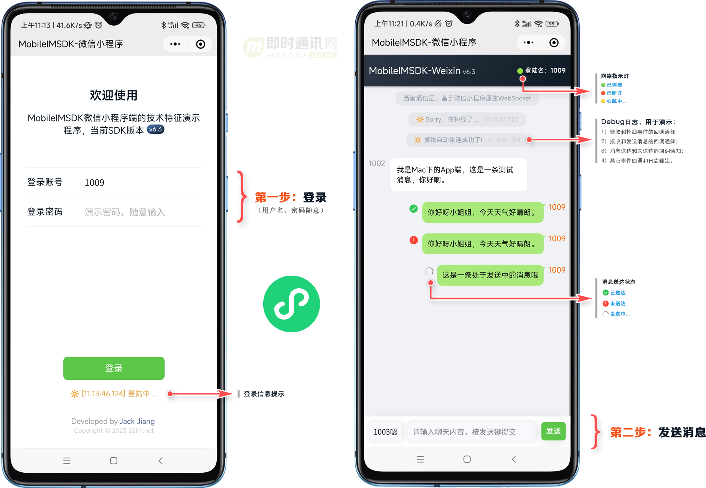

### 5、MobileIMSDK Demo在Uniapp端运行效果：

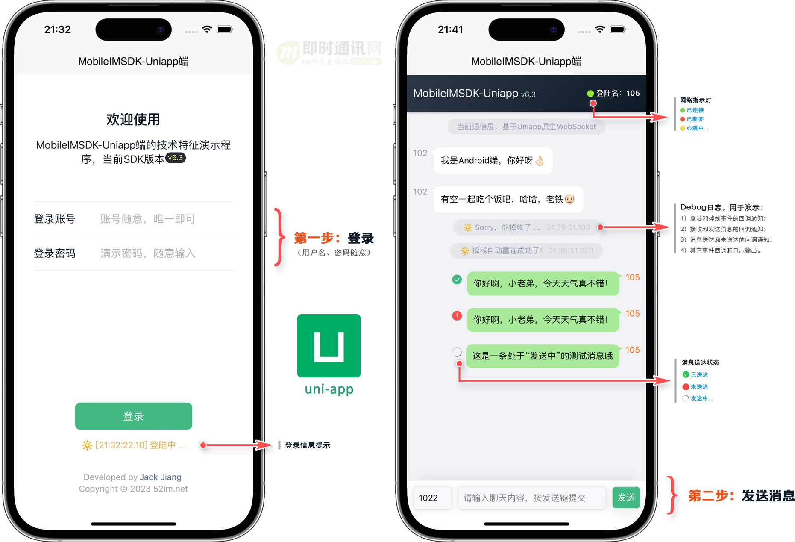

### 6、MobileIMSDK Demo在Windows 运行效果：
> <code>安装和使用：</code>[进入Java版Demo帮助页](http://www.52im.net/thread-56-1-1.html)。

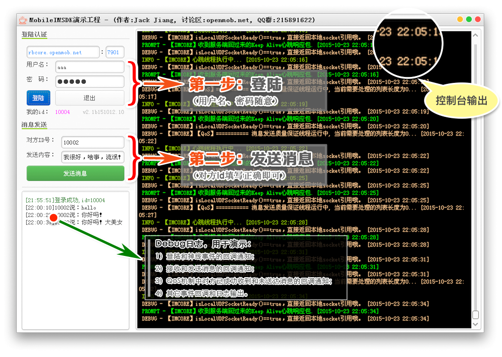

### 7、MobileIMSDK Demo在Mac OS X 运行效果：
> <code>安装和使用：</code>[进入Java版Demo帮助页](http://www.52im.net/thread-56-1-1.html)。

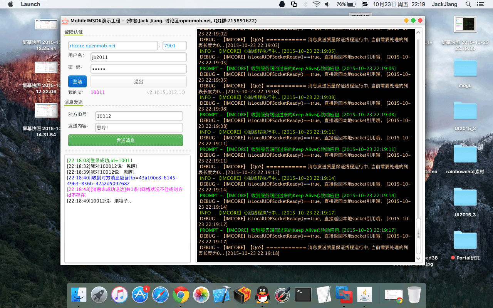

### 8、MobileIMSDK-Web版客户端Demo运行效果：
> <code>查看MobileIMSDK-Web版详情：</code>[点此进入](http://www.52im.net/thread-959-1-1.html)。

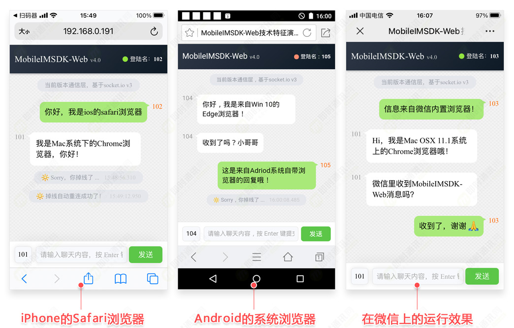

# 十四、【案例1】鸿蒙NEXT端IM产品RainbowTalk
> <code>更多资料请见：</code>[详细介绍](http://www.52im.net/thread-4822-1-1.html)、[运行截图](http://www.52im.net/thread-4824-1-1.html)、[安装体验](http://www.52im.net/thread-4825-1-1.html)。

# 十五、【案例2】移动端IM产品RainbowChat
> <code>更多资料请见：</code>[详细介绍](http://www.52im.net/thread-19-1-1.html)、[Android运行截图](http://www.52im.net/thread-20-1-1.html) 、[iOS运行截图](http://www.52im.net/thread-2730-1-1.html)、[安装体验](http://www.52im.net/thread-4739-1-1.html)（真机实拍视频：[Andriod端](https://www.bilibili.com/video/BV1sN411Y7a8/)、[iOS端](https://www.bilibili.com/video/BV1Rf4GzyEjh/)）。

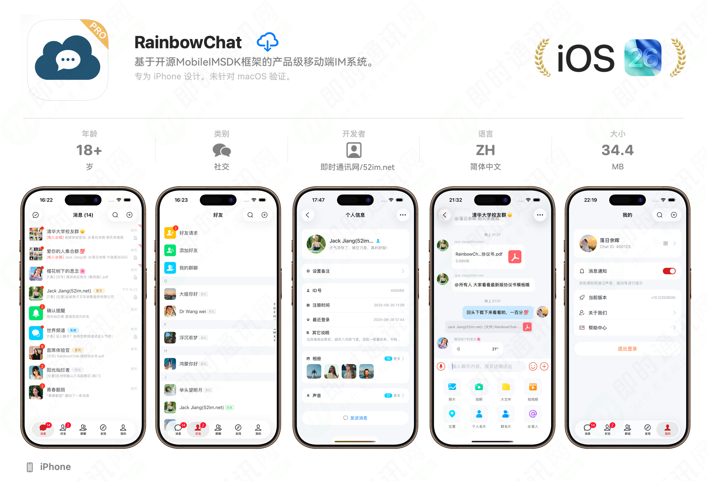

# 十六、【案例3】网页端IM产品RainbowChat-Web
> <code>更多截图和视频：</code>[详细介绍](http://www.52im.net/thread-2483-1-1.html)、[更多运行截图](http://www.52im.net/thread-2470-1-1.html)、[更多演示视频](http://www.52im.net/thread-2491-1-1.html)。

