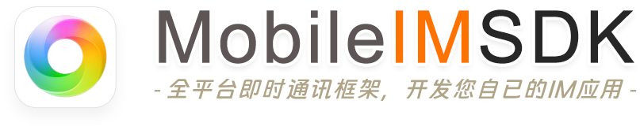

    

    
[文档手册](http://www.52im.net/forum.php?mod=collection&action=view&ctid=1&fromop=all)・[技术社区](http://www.52im.net/forum-89-1.html)・[更新日志](http://www.52im.net/thread-1270-1-1.html)・[产品案例❶](http://www.52im.net/thread-20-1-1.html)・[产品案例❷](http://www.52im.net/thread-4824-1-1.html)・[产品案例❸](http://www.52im.net/thread-2470-1-1.html)

:heart: <b>最新动态：</b>[鸿蒙Next端](https://github.com/JackJiang2011/MobileIMSDK/issues/34)已发布。基于MobileIMSDK的鸿蒙Next端IM产品[RainbowTalk](http://www.52im.net/thread-4822-1-1.html)已发布。 :heart:

# 一、快捷目录

* <b>❶ 📗 理论资料：</b>[网络编程理论经典《TCP/IP详解》（在线阅读版）](http://www.52im.net/topic-tcpipvol1.html) :triangular_flag_on_post:
* <b>❷ 📗 相关资料：</b>[版本更新日志](http://www.52im.net/thread-1270-1-1.html)、[常见问题解答](http://www.52im.net/thread-60-1-1.html) 、[性能测试报告](http://www.52im.net/thread-57-1-1.html) :triangular_flag_on_post:
* <b>❸ 📗 开发指南：</b> [Android](http://www.52im.net/thread-61-1-1.html)、[iOS](http://www.52im.net/thread-62-1-1.html)、[Java](http://www.52im.net/thread-59-1-1.html)、[H5](http://www.52im.net/thread-4239-1-1.html)、[微信小程序](http://www.52im.net/thread-4168-1-1.html)、[Uniapp](http://www.52im.net/thread-4226-1-1.html)、[鸿蒙Next](http://www.52im.net/thread-4767-1-1.html)、[服务端](http://www.52im.net/thread-63-1-1.html)。
* <b>❹ 📗 API文档：</b> [Android](http://docs.52im.net/extend/docs/api/mobileimsdk/android_tcp/)、[iOS](http://docs.52im.net/extend/docs/api/mobileimsdk/ios_tcp/)、[Java](http://docs.52im.net/extend/docs/api/mobileimsdk/java_tcp/)、[H5](http://www.52im.net/thread-4239-1-1.html)、[微信小程序](http://www.52im.net/thread-4168-1-1.html)、[Uniapp](http://www.52im.net/thread-4226-1-1.html)、鸿蒙Next（[完整手册](http://www.52im.net/thread-4767-1-1.html)、[API文档](http://docs.52im.net/extend/docs/api/mobileimsdk/harmony/)）[服务端](http://docs.52im.net/extend/docs/api/mobileimsdk/server/)。
* <b>❺ 📦 Demo安装和帮助：</b>  [Android](http://www.52im.net/thread-55-1-1.html)、[iOS](http://www.52im.net/thread-54-1-1.html)、[Java](http://www.52im.net/thread-56-1-1.html)、[H5](http://www.52im.net/thread-3682-1-1.html)、[微信小程序](http://www.52im.net/thread-4169-1-1.html)、[Uniapp](http://www.52im.net/thread-4225-1-1.html)、[鸿蒙Next](http://www.52im.net/thread-4766-1-1.html) :new:、[服务端](http://www.52im.net/thread-1272-1-1.html)。
* <b>❻ 🍀 产品案例1：</b> RainbowChat产品（[详细介绍](http://www.52im.net/thread-19-1-1.html)、[安装体验](http://www.52im.net/thread-4739-1-1.html)、[运行截图](http://www.52im.net/thread-20-1-1.html)  ） :point_left:
* <b>❼ 🍀 产品案例2：</b> RainbowTalk产品（[详细介绍](http://www.52im.net/thread-4822-1-1.html)、[安装体验](http://www.52im.net/thread-4825-1-1.html)、[运行截图](http://www.52im.net/thread-4824-1-1.html) ） :point_left:
* <b>❽ 🍀 产品案例3：</b>RainbowChat_Web产品（[详细介绍](http://www.52im.net/thread-2483-1-1.html)、[运行截图](http://www.52im.net/thread-2470-1-1.html) ） :point_left:

# 二、项目简介

<b>MobileIMSDK是一套全平台原创IM通信层框架：</b> 
* 历经10年、久经考验；
* 超轻量级、高度提炼，lib包50KB以内；
* 精心封装，一套API优雅支持<b>UDP</b> 、<b>TCP</b> 、<b>WebSocket</b>  三种协议（可能是全网唯一开源的）；
* 客户端支持iOS、Android、标准Java、H5([精编注释版](http://www.52im.net/thread-3682-1-1.html))、小程序([精编注释版](http://www.52im.net/thread-4169-1-1.html))、Uniapp([精编注释版](http://www.52im.net/thread-4225-1-1.html))、鸿蒙Next([SDK精编注释版](http://www.52im.net/thread-4766-1-1.html)、[Demo完整源码](https://gitee.com/jackjiang/MobileIMSDK/tree/master/demo_src/WebSocket/MobileIMSDK4HarmonyDemo))；
* 服务端基于Netty，性能卓越、易于扩展； :point_left:
* 可与姊妹工程 [MobileIMSDK-Web](http://www.52im.net/thread-959-1-1.html) 无缝互通实现网页端聊天或推送等； :point_left:
* 可应用于跨设备、跨网络的聊天APP、企业OA、消息推送等各种场景。

> MobileIMSDK工程自2013年10月起持续升级至今（当前最新版是v6.5，[版本更新日志点此查看](http://www.52im.net/thread-1270-1-1.html) ），历经10年，起初用作某自用产品的即时通讯底层，完全从零开发。目前，最新[鸿蒙Next端](http://www.52im.net/thread-4766-1-1.html)已开发完成，希望对需要的人有所启发和帮助。

# 三、源码仓库同步更新

* ❶ <b>GitHub：</b> [https://github.com/JackJiang2011/MobileIMSDK](https://github.com/JackJiang2011/MobileIMSDK)；
* ❷ <b>码云gitee：</b> [http://git.oschina.net/jackjiang/MobileIMSDK](http://git.oschina.net/jackjiang/MobileIMSDK)；
* ❸ <b>华为Gitcode：</b> [https://gitcode.com/hellojackjiang2011/MobileIMSDK](https://gitcode.com/hellojackjiang2011/MobileIMSDK)。

MobileIMSDK版本更新日志：[点此查看](http://www.52im.net/thread-1270-1-1.html) :point_left:

# 四、设计目标
让开发者专注于应用逻辑的开发，底层<code>复杂的即时通讯算法交由SDK开发人员</code>，从而<code>解偶即时通讯应用开发的复杂性</code>。

# 五、框架组成
<b>整套MobileIMSDK框架由以下7部分组成：</b>

1. <b>Android客户端SDK：</b>用于Android版即时通讯客户端，支持Android 4\.0及以上，[查看API文档](http://docs.52im.net/extend/docs/api/mobileimsdk/android_tcp/)；
2. <b>iOS客户端SDK：</b>用于开发iOS版即时通讯客户端，支持iOS 12\.0及以上，[查看API文档](http://docs.52im.net/extend/docs/api/mobileimsdk/ios_tcp/)；
3. <b>Java客户端SDK：</b>用于开发跨平台的PC端即时通讯客户端，支持Java 1\.6及以上，[查看API文档](http://docs.52im.net/extend/docs/api/mobileimsdk/java_tcp/)；
4. <b>H5客户端SDK：</b>暂无开源版，可[查看精编注释版](http://www.52im.net/thread-3682-1-1.html)；
5. <b>微信小程序端SDK：</b>暂无开源版，可[查看精编注释版](http://www.52im.net/thread-4169-1-1.html)；
6. <b>Uniapp端SDK：</b>暂无开源版，可[查看精编注释版](http://www.52im.net/thread-4225-1-1.html)；
7. <b>鸿蒙Next端SDK：</b>SDK暂无开源版（可[查看精编注释版](http://www.52im.net/thread-4766-1-1.html)），[Demo完整工程源码](https://gitee.com/jackjiang/MobileIMSDK/tree/master/demo_src/WebSocket/MobileIMSDK4HarmonyDemo)；
8. <b>服务端SDK：</b>用于开发即时通讯服务端，支持Java 1\.7及以上版本，[查看API文档](http://docs.52im.net/extend/docs/api/mobileimsdk/server/)。

<b>整套MobileIMSDK框架的架构组成：</b>

MobileIMSDK一直在持续开发和升级中，[鸿蒙Next客户端](http://www.52im.net/thread-4766-1-1.html) 是MobileIMSDK工程的最新成果。<b>另外：</b>MobileIMSDK可与姊妹工程 [MobileIMSDK-Web](http://www.52im.net/thread-959-1-1.html) 无缝互通，从而实现Web网页端聊天或推送等。

# 六、技术特征
* <b>久经考验：</b>历经10年，从Andriod 2.3、iOS 5.0 时代持续升级至今（绝不烂尾）；
* <b>超轻量级：</b>高度提炼，lib包50KB以内；
* <b>多种协议：</b>可能是全网唯一开源可一套API同时支持UDP、TCP、WebSocket三种协议的同类框架  :new:；
* <b>多种网络：</b>精心优化的TCP、UDP、WebSocket协议实现，可应用于卫星网、移动网、嵌入式物联网等场景；
* <b>多端覆盖：</b>客户端支持iOS、Android、标准Java、[H5](http://www.52im.net/thread-3682-1-1.html)、[微信小程序](http://www.52im.net/thread-4169-1-1.html)、[Uniap](http://www.52im.net/thread-4225-1-1.html)、[鸿蒙Next](http://www.52im.net/thread-4766-1-1.html)；
* <b>高效费比：</b>独有的UDP协议实现，无连接特性，同等条件下可实现更高的网络负载和吞吐能力；
* <b>消息走向：</b>支持即时通讯技术中消息的所有可能走向，共3种（即C2C、C2S、S2C）；
* <b>粘包半包：</b>优雅解决各端的TCP经典粘包和半包问题，底层封装，应用层完全无感知；
* <b>QoS机制：</b>完善的消息送达保证机制（自动重传、消息去重、状态反馈等），不漏过每一条消息；
* <b>健壮可靠：</b>实践表明，非常适于在高延迟、跨洲际、不同网络制式环境中稳定、可靠地运行；
* <b>断网恢复：</b>拥有网络状况自动检测、断网自动治愈的能力；
* <b>原创算法：</b>核心算法和实现均为原创，保证了持续改进和提升的空间；
* <b>多种模式：</b>预设多种实时灵敏度模式，可根据不同场景控制即时性、流量和客户端电量消耗；
* <b>数据压缩：</b>自有协议实现，未来可自主定制数据压缩，灵活控制客户端的流量、服务端网络吞吐；
* <b>高度封装：</b>高度封装的API接口，保证了调用的简易性，也使得可应用于更多的应用场景；
* <b>Web支持：</b>可与姊妹工程 [MobileIMSDK-Web](http://www.52im.net/thread-959-1-1.html) 无缝互通实现网页端聊天或推送等；:point_left:
* <b>扩展性好：</b>服务端基于Netty，继承了Netty的优秀高可扩展性；
* <b>性能优异：</b>服务端继承了Netty高性能、高吞吐特性，适用于高性能服务端场景。

> <b>MobileIMSDK 所支持的全部3种即时通讯消息走向分别是：</b> 
  (1) Client to Client (C2C)：即由某客户端主动发起，接收者是另一客户端； 
  (2) Client to Server (C2S)：即由某客户端主动发起，接收者是服务端； 
  (3) Server to Client (S2C)：即由服务端主动发起，接收者是某客户端。
  
:point_right: 您可能需要：[查看更多关于MobileIMSDK的疑问及解答](http://www.52im.net/thread-60-1-1.html)。

# 七、性能测试
压力测试表明，MobileIMSDK用于推送场景时，理论单机负载可接近千万级。用于聊天应用时，单机负载也可达数十万。（:point_right: 性能测试报告：[点此查看](http://www.52im.net/thread-57-1-1.html)）

> 当然，每款应用都有各自的特点和差异，请视具体场景具体评估之，测试数据仅供参考。

# 八、演示程序
1. <b>Android客户端 Demo：</b>[点此安装和使用](http://www.52im.net/thread-55-1-1.html)；
2. <b>iOS客户端 Demo：</b>[点此安装和使用](http://www.52im.net/thread-54-1-1.html)；
3. <b>Java客户端 Demo：</b>[点此安装和使用](http://www.52im.net/thread-56-1-1.html)；
4. <b>H5客户端 Demo：</b>[点此查看介绍](http://www.52im.net/thread-3682-1-1.html)；
5. <b>微信小程序端 Demo：</b>[点此查看介绍](http://www.52im.net/thread-4169-1-1.html)；
6. <b>Uniapp端 Demo：</b>[点此查看介绍](http://www.52im.net/thread-4225-1-1.html)；
7. <b>鸿蒙Next端 Demo：</b>[点此查看介绍](http://www.52im.net/thread-4766-1-1.html)  :new:；
8. <b>服务端 Demo：</b>[点此安装和使用](http://www.52im.net/thread-1272-1-1.html)。

# 九、应用案例
#### ❶ RainbowChat是一款基于MobileIMSDK的产品级Android和iOS聊天APP：
> 更多详情：[查看详细介绍](http://www.52im.net/thread-19-1-1.html)、[点击下载体验](http://www.52im.net/thread-4739-1-1.html) 或 [查看运行截图](http://www.52im.net/thread-20-1-1.html)。

#### ❷ RainbowTalk是一套基于MobileIMSDK的纯血鸿蒙NEXT产品级聊天APP：
> 更多详情：[查看详细介绍](http://www.52im.net/thread-4822-1-1.html)、[点击安装体验](http://www.52im.net/thread-4825-1-1.html) 或 [查看运行截图](http://www.52im.net/thread-4824-1-1.html)。

#### ❸ RainbowChat-Web是一套基于MobileIMSDK-Web的网页端产品级聊天系统：
> 更多详情：[查看详细介绍](http://www.52im.net/thread-2483-1-1.html)、[查看运行截图](http://www.52im.net/thread-2470-1-1.html) 、 [查看运行视频](http://www.52im.net/thread-2491-1-1.html)。

# 十、典型应用场景
### :triangular_flag_on_post: 场景1：聊天APP
* <b>应用说明：</b>可用于开发类似于微信、QQ等聊天工具。 
* <b>消息走向：</b>需使用C2C、C2S、S2C全部类型。 
* <b>特别说明：</b>MobileIMSDK并未定义聊天应用的应用层逻辑和协议，开发者可自行定义并实现之。

### :triangular_flag_on_post: 场景2：消息推送
* <b>应用说明：</b>可用于需要向客户端实时推送信息的各种类型APP。 
* <b>消息走向：</b>仅需使用S2C 1种消息走向，属MobileIMSDK的最简单应用场景。

### :triangular_flag_on_post: 场景3：企业OA
* <b>应用说明：</b>可用于实现企业OA的指令、公文、申请等各种消息实时推送，极大提升用户体验，并可延伸至移动设备。 
* <b>消息走向：</b>仅需使用S2C 1种消息走向，属MobileIMSDK的最简单应用场景。

### :triangular_flag_on_post: 场景4：企业OA的增强型
* <b>应用说明：</b>可用于实现企业OA中各种系统级、用户级消息的实时互动，充分利用即时通讯技术提升传统OA的价值。 
* <b>消息走向：</b>可使用C2C、C2S、S2C全部类型，这与聊天APP在很多方面已无差别，但企业OA有自已的用户关系管理模型和逻辑，较之全功能聊天APP要简单的多。

# 十一、开发指南
1. <b>Android客户端开发指南：</b>[点此查看](http://www.52im.net/thread-61-1-1.html)；
2. <b>iOS客户端开发指南：</b>[点此查看](http://www.52im.net/thread-62-1-1.html)；
3. <b>Java客户端开发指南：</b>[点此查看](http://www.52im.net/thread-59-1-1.html)；
4. <b>H5客户端开发指南：</b>[点此查看](http://www.52im.net/thread-4239-1-1.html)；
5. <b>微信小程序端开发指南：</b>[点此查看](http://www.52im.net/thread-4168-1-1.html)；
6. <b>Uniapp端开发指南：</b>[点此查看](http://www.52im.net/thread-4226-1-1.html)；
7. <b>鸿蒙Next端开发指南：</b>[点此查看](http://www.52im.net/thread-4767-1-1.html)；
8. <b>Server端开发指南：</b>[点此查看](http://www.52im.net/thread-63-1-1.html)。

# 十二、授权方式
你可永久免费且自由地使用MobileIMSDK，如：用于研究、借鉴、甚至商业用途，但禁止在超越License约束内容的情况下用于商业用途等，请尊重知识产权。
更详细的授权说明，请见[MobileIMSDK社区介绍贴](http://www.52im.net/thread-52-1-1.html)中的“十二、授权方式”一节。

> <b>补充说明：</b>如您还需获得更多技术支持或技术合作请联系作者，QQ：<code>413980957</code>（ :point_right: [关于作者](http://www.52im.net/thread-2792-1-1.html)）。

# 十三、联系方式
* 讨论交流和资料区：:earth_americas: [点此进入](http://www.52im.net/forum-89-1.html)；
* 即时通讯技术交流群：`185926912`  （[更多QQ群点此进入](http://www.52im.net/portal.php?mod=topic&topicid=2)）；
* bug和建议请发送至： :love_letter: `jb2011@163.com`；
* 合作/咨询等欢迎联系作者QQ： :penguin: `413980957`、微信：`hellojackjiang`  （ :point_right: [关于作者](http://www.52im.net/thread-2792-1-1.html)）。

# 十四、捐助作者
优秀的开源需要您的支持才能走的更远，衷心感谢您的支持与理解，也希望您能从开源中收益。捐助链接： [点此进入](http://www.52im.net/thread-411-1-1.html)。

# 十五、关注作者
* 关于作者：[点击进入](http://www.52im.net/thread-2792-1-1.html) :point_left:
* 推荐关注：[BeautyEye工程](https://github.com/JackJiang2011/beautyeye)
* 博客地址：[点击入进](http://www.52im.net/space-uid-1.html)
* Github主页：[点击进入](https://github.com/JackJiang2011)
* 我的公众号：:point_down: :point_down:

 

# 附录：Demo运行截图
### 1、MobileIMSDK Demo在鸿蒙Next端运行效果：
> <code>编译和运行：</code>[查看鸿蒙Next端Demo完整源码](https://gitee.com/jackjiang/MobileIMSDK/tree/master/demo_src/WebSocket/MobileIMSDK4HarmonyDemo)。

### 2、MobileIMSDK Demo在Android端、iOS端运行效果：
> <code>安装和使用：</code>[进入Android版Demo帮助页](http://www.52im.net/thread-55-1-1.html)、[进入iOS版Demo帮助页](http://www.52im.net/thread-54-1-1.html)。

### 3、MobileIMSDK Demo在H5端运行效果：

### 4、MobileIMSDK Demo在微信小程序端运行效果：

### 5、MobileIMSDK Demo在Uniapp端运行效果：

### 6、MobileIMSDK Demo在Windows 运行效果：
> <code>安装和使用：</code>[进入Java版Demo帮助页](http://www.52im.net/thread-56-1-1.html)。

### 7、MobileIMSDK Demo在Mac OS X 运行效果：
> <code>安装和使用：</code>[进入Java版Demo帮助页](http://www.52im.net/thread-56-1-1.html)。

### 8、MobileIMSDK-Web版客户端Demo运行效果：
> <code>1）MobileIMSDK-Web Demo在手机端浏览器运行效果：</code>[查看MobileIMSDK-Web版详情](http://www.52im.net/thread-959-1-1.html)。

> <code>2）MobileIMSDK-Web Demo在PC端多种主流浏览器的运行效果：</code>[查看MobileIMSDK-Web版详情](http://www.52im.net/thread-959-1-1.html)。

# 案例1：鸿蒙NEXT端IM产品RainbowTalk
> <code>更多资料请见：</code>[详细介绍](http://www.52im.net/thread-4822-1-1.html)、[运行截图](http://www.52im.net/thread-4824-1-1.html)、[安装体验](http://www.52im.net/thread-4825-1-1.html)。

# 案例2：移动端IM产品RainbowChat
> <code>关于RainbowChat产品的更多资料请见：</code>[详细介绍](http://www.52im.net/thread-19-1-1.html)、[运行截图](http://www.52im.net/thread-20-1-1.html)、[安装体验](http://www.52im.net/thread-4739-1-1.html)（真机实拍视频：[Andriod端](https://v.youku.com/v_show/id_XNTg4NDE2MjE1Mg==.html)、[iOS端](https://v.youku.com/v_show/id_XNDcwMDA4MDQwMA==.html)）。

> <code>更多清晰运行截图请见：</code>[RainbowCha产品的全部功能截图](http://www.52im.net/thread-20-1-1.html)。

# 案例3：网页端IM产品RainbowChat-Web
### :triangular_flag_on_post: RainbowChat-Web产品主界面：
> <code>更多截图和视频：</code>[更多截图点此进入](http://www.52im.net/thread-2470-1-1.html)、[更多演示视频点此进入](http://www.52im.net/thread-2491-1-1.html)。

### :triangular_flag_on_post: RainbowChat-Web产品主界面(独立UI效果)：
> <code>更多截图和视频：</code>[更多截图点此进入](http://www.52im.net/thread-2470-1-1.html)、[更多演示视频点此进入](http://www.52im.net/thread-2491-1-1.html)。

